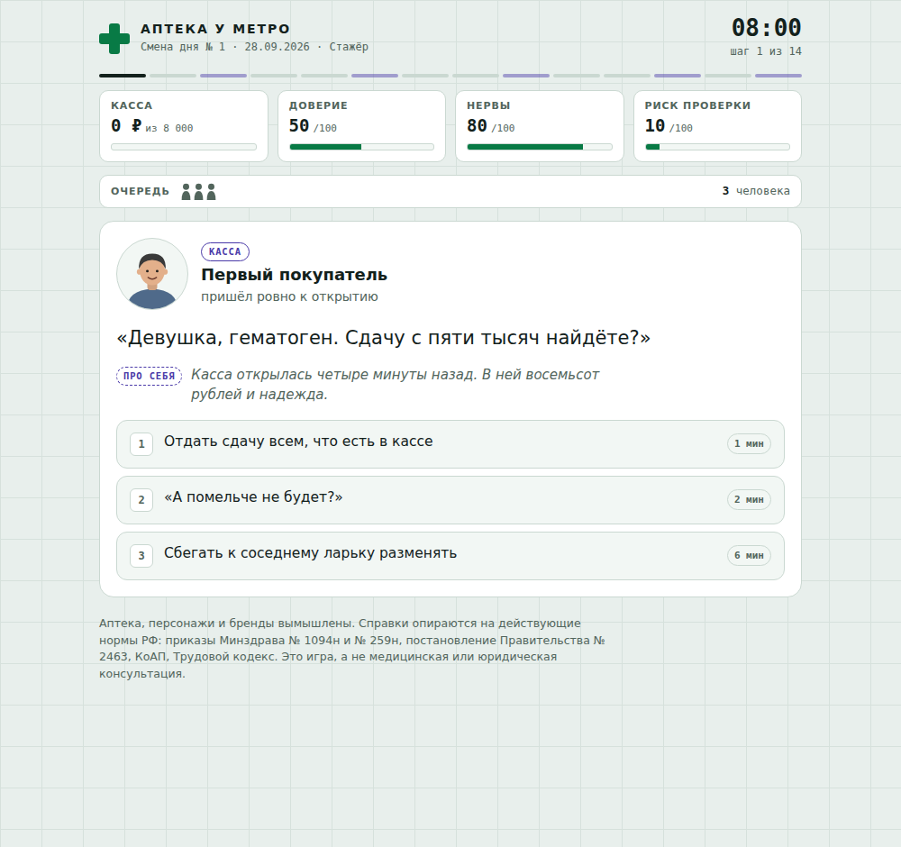

# Первостольник

Браузерная игра-симулятор смены фармацевта первого стола в российской аптеке.

**▶ Играть: https://karonskiy-a11y.github.io/pervostolnik/**



За смену вы обслуживаете двенадцать посетителей. Бабушке нужны «белые круглые от давления», мужчина требует антибиотик без рецепта, тайный покупатель следит за каждым словом, а заведующая ждёт выполнения плана по БАДам. На каждую ситуацию есть три варианта ответа, и каждый меняет четыре показателя:

| Показатель | Что значит |
|---|---|
| **Касса** | Выручка за смену. План 8 000 ₽. |
| **Доверие** | Упадёт до нуля, и район уйдёт в аптеку напротив. |
| **Нервы** | Закончатся раньше смены, и вы уйдёте на больничный. |
| **Риск проверки** | Растёт от нарушений. С 55 приходит Росздравнадзор, на 100 работу аптеки приостанавливают. |

После каждого ответа касса «пробивает чек» с последствиями и справкой о том, какое правило действует на самом деле. В конце смены вы получаете Z-отчёт с журналом решений и звание: от «Фармацевта месяца» до «Постоянного клиента Росздравнадзора».

## Как запустить

Игра умещается в одном файле `index.html` и не требует сборки и зависимостей.

- **Локально:** откройте `index.html` в любом браузере.
- **На GitHub Pages:** в репозитории откройте *Settings → Pages*, в поле *Source* выберите *Deploy from a branch*, ветку `main` и папку `/ (root)`. Через минуту игра будет доступна по адресу `https://<ваш-логин>.github.io/<имя-репозитория>/`.

Управление: мышь или клавиши `1`, `2`, `3` для выбора ответа, `Enter` для перехода к следующему посетителю.

## Как устроен код

Всё лежит в `index.html`: стили в `<style>`, логика и данные в одном `<script>` на чистом JavaScript.

| Что | Где искать в `index.html` |
|---|---|
| Цвета, шрифты, светлая и тёмная темы | блок `:root` в начале `<style>` |
| Все ситуации с посетителями | объект `CARDS` |
| Стартовые значения и план | константы `PLAN`, `START`, `INSPECT_AT` |
| Порядок смены | функция `newShift()`: первая всегда бабушка, шестым идёт обед, остальные 10 выпадают случайно из 20 |
| Штраф на проверке | функция `fineOf()` |
| Звания в конце | функция `rankOf()` |
| Портреты посетителей | функция `avatar()`, рисует SVG из параметров |

### Как добавить свою ситуацию

Добавьте в объект `CARDS` новую запись. Она сама попадёт в случайную выборку:

```js
myCase: {
  who: 'Имя посетителя',
  role: 'кто он, одна строка',
  tag: 'Консультация',            // категория на плашке
  av: { s: 0, st: 'short', hair: '#3b2f28', top: '#2c3440', m: 'flat' },
  say: 'Что говорит посетитель.',
  choices: [
    { label: 'Вариант ответа', out: 'Что из этого вышло.', d: { c: 300, t: 5, n: -4, r: 0 }, q: 'ok' },
    { label: 'Другой вариант', out: '…', d: { c: 900, t: -8, r: 12 }, q: 'bad' },
    { label: 'Третий вариант', out: '…', d: { t: 2, n: -10 }, q: 'meh' }
  ],
  fact: 'Какое правило здесь действует на самом деле.'
}
```

- `d` задаёт изменения показателей: `c` касса в рублях, `t` доверие, `n` нервы, `r` риск проверки.
- `q` отмечает ответ в итоговом журнале: `ok` по правилам, `meh` спорно, `bad` нарушение.
- `av` описывает портрет: `s` оттенок кожи (0–2); `st` причёска (`short`, `long`, `bun`, `bald`, `cap`, `hood`, `scarf`); `m` выражение лица (`smile`, `flat`, `worried`, `angry`); `g: 1` добавляет очки; `x` задаёт аксессуар (`tie`, `sun`, `phones`).
- Для рецепта на экране добавьте `prop: () => rx({...})`, для экрана кассы с блокировкой `prop: scan`. Примеры есть в записях `expired` и `scanner`.

## На чём основаны справки

- Приказ Минздрава России от 24.11.2021 № 1094н: сроки действия рецептов, запрет исправлений в рецепте.
- Приказ Минздрава России от 29.04.2025 № 259н (правила надлежащей аптечной практики): обязанность сообщать о препаратах с более низкой ценой.
- Постановление Правительства РФ от 31.12.2020 № 2463: лекарства надлежащего качества обмену и возврату не подлежат.
- КоАП РФ, ст. 14.1: ответственность за нарушение лицензионных требований.
- Трудовой кодекс РФ, ст. 108: перерыв для отдыха и питания.

Аптека, персонажи и названия препаратов вроде «Брендофена» вымышлены. Это игра, а не медицинская или юридическая консультация.
