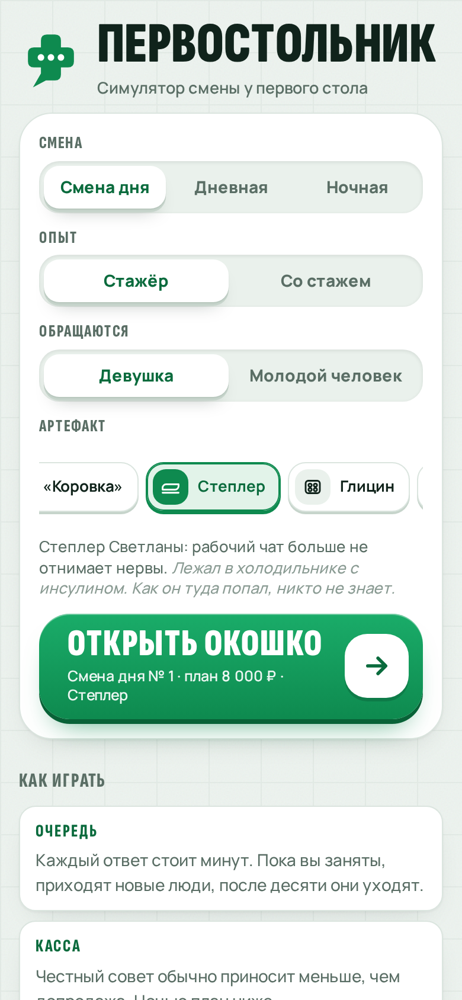
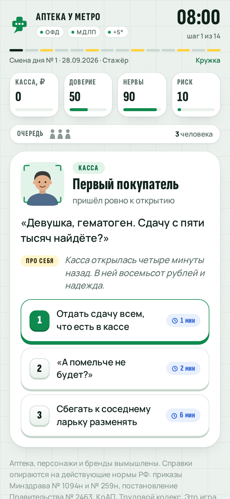
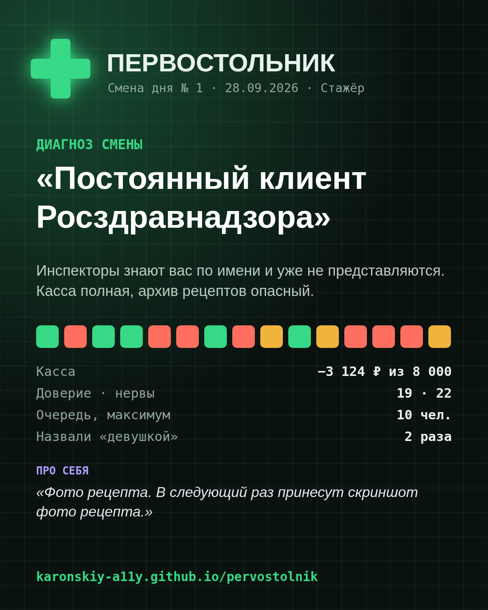

# Первостольник

Браузерная игра о смене фармацевта первого стола в российской аптеке.

**▶ Играть: https://karonskiy-a11y.github.io/pervostolnik/**

<p>
  
  
  
</p>

Двенадцать часов у первого стола. Бабушке нужны «белые круглые от давления, как в прошлый раз». Мужчина требует антибиотик, потому что «мне всегда без рецепта давали». Муж показывает фото от жены: полкоробки, палец и блик. Заведующая пишет в рабочий чат: «Девочки, фото выкладки до 10:00!!!»

Каждый ответ занимает несколько минут, а очередь растёт, пока вы консультируете. Приходится выбирать, как работать: правильно или быстро.

Игра рассчитана на тех, кто сам стоял за первым столом, и на всех, кому интересно, как устроена работа в аптеке. Она бесплатная, работает с телефона и не требует установки.

## Как играть

Смена состоит из четырнадцати шагов: покупатели, события и мини-игры. На каждого покупателя есть три варианта ответа, и каждый вариант меняет пять показателей.

| Показатель | Что значит |
|---|---|
| **Касса** | Выручка за смену против плана. Честный совет обычно приносит меньше, чем допродажа. |
| **Доверие** | Упадёт до нуля — район уйдёт в аптеку напротив. |
| **Нервы** | Закончатся раньше смены — вы уйдёте на больничный. |
| **Риск проверки** | Растёт от нарушений. Чем он выше, тем вероятнее придёт инспектор Росздравнадзора. |
| **Очередь** | Каждый ответ стоит минут. Пока вы заняты, приходят новые люди, после десяти они уходят. |

После каждого решения касса пробивает чек со справкой: какое правило здесь действует на самом деле.

## Что внутри

- **Больше пятидесяти ситуаций.** Среди них «вы же просто продавец», «на сайте у вас дешевле», «мне нейросеть сказала», «жена сказала взять вот это», «позовите старшего», просрочка на полке и инвентаризация после смены.
- **Внутренний голос.** У каждой ситуации есть строчка «Про себя»: то, что фармацевт думает, но вслух не говорит.
- **Шесть мини-игр на рабочие навыки:**
  - почерк врача: угадать препарат по каракулям на время;
  - экспертиза рецепта: найти ошибки прямо на бланке 107-1/у;
  - аналог по МНН: выбрать с полки замену, обходя ловушки с другой дозой, формой и составом;
  - час пик: пятеро подряд за гематогеном, бахилами и тестом на беременность;
  - скрипт продаж: чек-лист сети против человека с болью в груди;
  - приёмка: найти в приходе брак.
- **Смена дня.** Одна и та же смена у всех игроков в течение дня. Результат копируется в чат вместе с цветной сеткой решений.
- **Ночная смена.** Работа через окошко: таксисты, «жвачку и чек не надо», доширак в три часа ночи.
- **Двадцать один артефакт.** Большинство находится прямо во время смены, после конкретной ситуации:
  - Валентина Петровна после правильно подобранных «белых круглых» оставит конфету «Коровка» (+2 доверия от каждого пожилого покупателя);
  - степлер Светланы найдётся в холодильнике с инсулином, и рабочий чат перестанет отнимать нервы;
  - после зависания кассы на ОФД из подсобки достанут старую «Оку», которая всегда даёт сдачу;
  - портрет заведующей в рамке снижает риск проверки, но каждое спорное решение стоит нервов;
  - глицин в кармане ничего не делает, но с ним кажется, что нервы тратятся меньше.

  Ещё в коллекции есть счастливые бахилы, сабо с дырочками, лупа с витрины, табличка «Технический перерыв 15 минут», сертификат на 144 балла НМО, фикус с первого стола и справочник Машковского. У каждого предмета есть эффект на смену и короткая история.
- **Итог смены.** Диагноз вроде «Святой первого стола», «Ходячий Машковский» или «Постоянный клиент Росздравнадзора», Z-отчёт и счётчик жизы: сколько раз вас назвали «девушкой» и сколько раз спросили «а подешевле?». Ещё есть расчётный листок с бонусом за БАД и штрафом от тайного покупателя, а также картинка для рабочего чата.
- **Коллекции и режимы.** Бестиарий из почти шестидесяти типажей, значки и два режима: «Стажёр» со справками и «Со стажем» с короткими таймерами без подсказок.

## Как запустить

Вся игра — один файл `index.html`, сборка и зависимости не нужны.

- **Локально:** откройте `index.html` в браузере.
- **На GitHub Pages:** *Settings → Pages*, источник *Deploy from a branch*, ветка `main`, папка `/ (root)`.

Управление: мышь, касание или клавиши `1`–`4` для выбора ответа, `Enter` для перехода к следующему покупателю. Прогресс (бестиарий, значки, артефакты, рекорд) хранится в браузере игрока.

## Как устроен код

Стили, логика и данные лежат в `index.html`. Скрипт написан на чистом JavaScript.

| Что | Где искать |
|---|---|
| Цвета, шрифты, дневная и ночная темы | `:root` и `:root.night` в начале `<style>` |
| Ситуации с покупателями | объект `CARDS` |
| Внутренний голос, бонусы и штрафы, счётчик жизы | объекты `THINK`, `PAY`, `JZ` |
| Сообщения рабочего чата | массивы `CHAT` и `CHAT_NIGHT` |
| Мини-игры | объект `MINIS`, функции `initMini()` и `…View()` |
| Артефакты | массив `ARTS`: описание, история и условие открытия, иконка в `ICON`; эффекты на ходу — в `finish()`, находки — в `closeShift()` |
| Порядок смены | `newShift()`: дневная и ночная раскладки |
| Смена дня | `seeded()` — генератор случайных чисел от даты |
| Звания, баллы, расчётный листок | `rankOf()`, `score()`, `payslip()` |
| Логотип и картинка для шеринга | `LOGO`, `shareCanvas()`, ссылка в `SHARE_URL` |

### Как добавить свою ситуацию

Добавьте запись в `CARDS`, и она попадёт в случайную выборку:

```js
myCase: {
  bx: 'Название для бестиария',
  who: 'Имя', role: 'кто это, одна строка', tag: 'Консультация',
  when: 'night',                          // только для ночной смены; без поля — дневная
  av: { s: 0, st: 'short', hair: '#3b2f28', top: '#2c3440', m: 'flat' },
  say: '{A}, что говорит покупатель.',     // {A} — «Девушка» или «Молодой человек»
  choices: [
    { m: 1, label: 'Вариант', out: 'Что вышло.', d: { c: 300, t: 5, n: -4, r: 0 }, q: 'ok' },
    { m: 5, label: 'Другой вариант', out: '…', d: { c: 900, t: -8, r: 12 }, q: 'bad' },
    { m: 2, label: 'Третий вариант', out: '…', d: { t: 2, n: -10, q: -1 }, q: 'meh' }
  ],
  fact: 'Правило, которое здесь действует.'   // или note: 'Наблюдение из жизни.'
}
```

- `m` — сколько минут занимает ответ; каждые три минуты в очередь приходит новый человек.
- `d` меняет показатели: `c` касса в рублях, `t` доверие, `n` нервы, `r` риск проверки, `q` очередь.
- `q` отмечает решение в журнале: `ok` по правилам, `meh` спорно, `bad` нарушение.
- `served: 0` — событие, в котором никого не обслужили: звонок, начальство, перерыв.
- Строчку внутреннего голоса добавьте в `THINK`, а бонус или штраф для расчётного листка — в `PAY` по ключу `'myCase:0'`, где число — номер варианта.

## На чём основаны справки

- Приказ Минздрава России от 24.11.2021 № 1094н: сроки действия рецептов, реквизиты бланка, запрет исправлений.
- Приказ Минздрава России от 29.04.2025 № 259н: обязанность сообщать о препаратах с более низкой ценой.
- Постановление Правительства РФ от 31.12.2020 № 2463: лекарства надлежащего качества не подлежат обмену и возврату.
- КоАП РФ, ст. 14.1: ответственность за нарушение лицензионных требований.
- Трудовой кодекс РФ, ст. 99, 108, 152 и 154: сверхурочная работа, перерыв на обед, оплата сверхурочных и ночных часов.
- Закон о рекламе: реклама рецептурных препаратов и БАД.

Аптека, персонажи и названия препаратов вроде «Брендофена» вымышлены. Это игра, а не медицинская или юридическая консультация.

Шрифты — [Manrope](https://fonts.google.com/specimen/Manrope), [Sofia Sans Extra Condensed](https://fonts.google.com/specimen/Sofia+Sans+Extra+Condensed), [JetBrains Mono](https://fonts.google.com/specimen/JetBrains+Mono) и [Caveat](https://fonts.google.com/specimen/Caveat) из Google Fonts.
